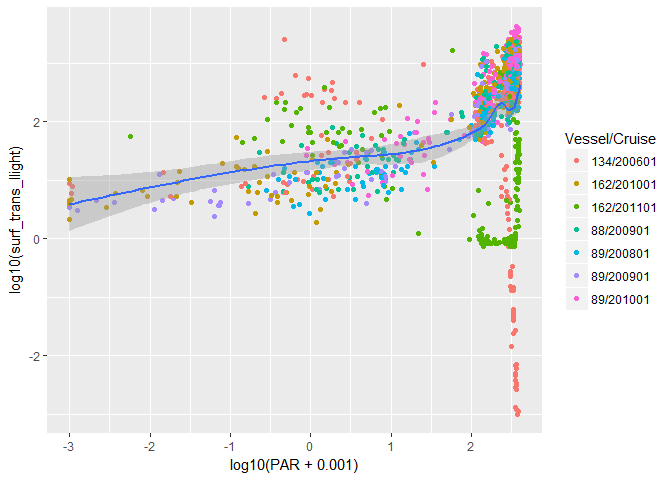
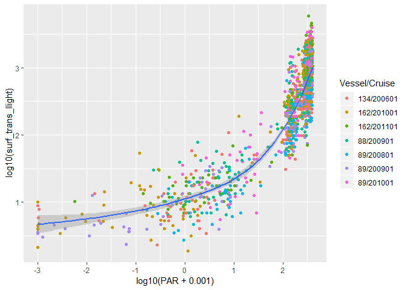
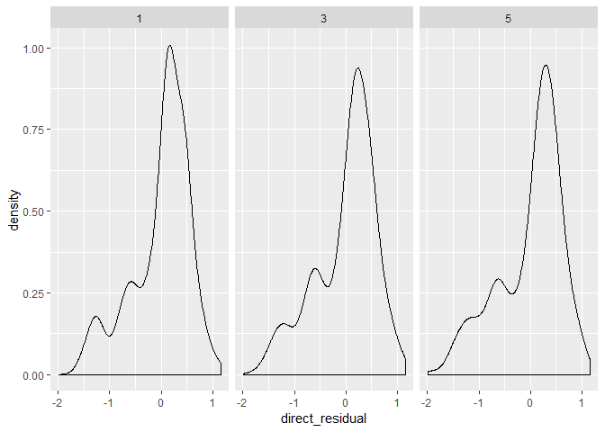

TLUtilities
================

Introduction
------------

This package contains functions designed to process RACE light data using functions in the trawllight package. While trawllight provides functions to process light data, it is designed to work for a generic data structure, rather than being tailored to specifically processing RACE data. TLUtilities provides functions to read-in RACE data and iterate over casts to estimate optical parameters.

This document demonstrates how light data is processed using TLUtilities and trawllight.

Installing trawllight and TLUtilities
-------------------------------------

Install trawlllight and TLUtilities from their GitHub repositories. Functions in the trawllight pacakage have full documentation. Not all functions in TLUtilities currently have documentation.

``` r
library(trawllight)
library(TLUtilities)
```

Import directory structure
--------------------------

TLUtilities requires the user to pass a character vector indicating where light data are maintained. Each directory should contain a single file names CastTimes.csv, a single file named corr\_Mk9Hauls.csv, and any number (including zero) of files named deck\*\*.csv. The CastTimes.csv files contains survey event times associated with cast start/stop. The corr\_Mk9.Hauls.csv file contains data from a TDR-Mk9 archival tag with time-stamps shifted to match 'survey' time in cases where temporal drift occurred.

``` r
light.dir <- read.csv("./imports/directories.csv", stringsAsFactors = F, header = F)

# Select EBS shelf directories
light.dir <- light.dir[which(grepl("ebs", light.dir[,1])),1]

light.dir[1:3]
```

    ## [1] "data\\LightData\\Data\\year_04\\ebs\\v_88"
    ## [2] "data\\LightData\\Data\\year_04\\ebs\\v_89"
    ## [3] "data\\LightData\\Data\\year_05\\ebs\\v_88"

Read-in and process trawl light data
------------------------------------

The `process_all` function is a wrapper which runs `vertical_profiles`, `trawllight::convert_light`, `trawllight::filter_stepwise`, `trawllight::calculate_attenuation` for every cast in each of the target directories. The `vertical_profiles` function uses CastTimes to extract the light measurements from corr\_Mk9Hauls.csv which were obtained during upcasts or downcasts. A time buffer can be specified to extend the cast time window, and seems necessary to handle situations where cast times are not perfectly accurate. Other arguments can be passed to the functions which are used for processing each cast.

Downcasts and Upcasts should be processed in separate function calls, but multiple years can be processed using one funciton call. Processing should be limited to 4-6 vessel/cruise combinations to avoid issues with R memory limits (which can substantially increase processing time or cause R to crash). Here, processing is demonstrated for one vessel and one year.

``` r
ebs <- process_all(dir.structure = light.dir[10:12],
                   cast.dir = "Downcast",
                   time.buffer = 20,
                   silent = T)
```

Vertical profiles
-----------------

A list containing four data frames gets returned by `process_all`: \* `loess_eval` contains information about loess model fits between depth and log(light), with one record for each model that was fitted. \* `resid_fit` contains depth-specific residuals for each fitted loess model. \* `atten_values` contains instantaneous attenuation, by user-specified depth intervals, for each cast. \* `light_ratios` contains converted light measurements and proportion of light relative to the shallowest depth bin, for each depth bin and cast. For cases when the shallowest depth bin is equal to the reference depth: light\_ratios$light\_ratio = exp(-\[Optical Depth\]

``` r
names(ebs)
```

    ## [1] "loess_eval"   "atten_values" "light_ratios" "resid_fit"

``` r
head(ebs$loess_eval)
```

    ##    span_fit nobs      enp        rse smooth_trace fit_method vessel cruise
    ## 1 0.2910569   36 6.635794 0.17961858     7.888946       aicc     89 200801
    ## 2 0.5535042   15 3.468756 0.08938001     4.087326       aicc     89 200801
    ## 3 0.6739448   14 3.215754 0.13379515     3.777037       aicc     89 200801
    ## 4 0.8883854   16 2.465050 0.13012491     2.810392       aicc     89 200801
    ## 5 0.6295183   21 3.198044 0.03607755     3.736152       aicc     89 200801
    ## 6 0.6168078   15 3.758839 0.13642258     4.444581       aicc     89 200801
    ##   haul
    ## 1    1
    ## 2    2
    ## 3    3
    ## 4    4
    ## 5    5
    ## 6    6

``` r
head(ebs$resid_fit)
```

    ##      residual log_trans_llight cdepth vessel cruise haul
    ## 1 -0.13267069         5.771919      1     89 200801    1
    ## 2  0.12355795         5.375319     11     89 200801    1
    ## 3  0.07095586         5.243119     13     89 200801    1
    ## 4  0.05681863         4.978719     15     89 200801    1
    ## 5  0.07815925         4.714319     17     89 200801    1
    ## 6  0.15090459         4.449919     19     89 200801    1

``` r
head(ebs$atten_values)
```

    ##   depth      k_aicc vessel cruise haul
    ## 1  1.25 -0.06615312     89 200801    1
    ## 2  1.75 -0.06340003     89 200801    1
    ## 3  2.25 -0.06109052     89 200801    1
    ## 4  2.75 -0.05922458     89 200801    1
    ## 5  3.25 -0.05780223     89 200801    1
    ## 6  3.75 -0.05682346     89 200801    1

``` r
head(ebs$light_ratios)
```

    ##   vessel cruise haul   updown cdepth trans_llight quality light_ratio
    ## 1     89 200801    1 Downcast      1    321.15352    -999   1.0000000
    ## 2     89 200801    1 Downcast     11    216.00882    -999   0.6726030
    ## 3     89 200801    1 Downcast     13    189.25953    -999   0.5893117
    ## 4     89 200801    1 Downcast     15    145.28819    -999   0.4523948
    ## 5     89 200801    1 Downcast     17    111.53286    -999   0.3472883
    ## 6     89 200801    1 Downcast     19     85.62003    -999   0.2666016
    ##     k_linear  k_column
    ## 1        NaN 0.1499341
    ## 2 0.03966000 0.1499341
    ## 3 0.04406667 0.1499341
    ## 4 0.05665714 0.1499341
    ## 5 0.06610000 0.1499341
    ## 6 0.07344444 0.1499341

Read-in surface (deck) light data
---------------------------------

The `process_all_surface()` function is a wrapper which runs `TLUtilities::surface_light` and `trawllight::convert_light()` for every vessel/cruise/haul in each of the specified directories. If time\_adjustments is TRUE, the function also runs `TLUtilities::time_adjustments`.

The `surface_light` function finds surface light measurements which were obtained between the beginning and end of a cast, plus a time buffer in seconds.

The `time_adjustments` function adjusts timestamps from the surface light meter to account for a mismatch between tag time and survey time. However, the function only provides an example of how I made corrrections, so <b>time\_adjustments.R</b> will need to have logical operations rewritten to correct timestamps in other regions. I determined what the offsets should be by visually inpsecting plots of time versus surface light, and time versus predicted light generated by a global irradiance model.

All directories can be processed in one function call. The function should automatically ignore years where no deck\*\*.csv file is found in a directory. Measurements obtained during upcasts and downcasts can be obtained at the same time. This code only processes eight vessel/cruises (for a reason):

``` r
ebs_surface <- process_all_surface(dir.structure = light.dir[c(1, 5, 10:15)], adjust.time = F, time.buffer = 30, agg.fun = geometric.mean)
```

    ## Warning in process_all_surface(dir.structure = light.dir[c(1, 5,
    ## 10:15)], : process_all_surface: Deck light measurements not found in
    ## data\LightData\Data\year_04\ebs\v_88

Note that `time_adjustments` applied a user-specified correction to 162-201101.

``` r
head(ebs_surface)
```

    ##   haul   updown vessel cruise surf_trans_llight
    ## 1    3 Downcast    134 200601         1315.6059
    ## 2    4 Downcast    134 200601         1790.9818
    ## 3    5 Downcast    134 200601         1032.4459
    ## 4    6 Downcast    134 200601          109.1023
    ## 5    7 Downcast    134 200601          281.3837
    ## 6    8 Downcast    134 200601         1055.4466

``` r
table(ebs_surface$updown, ebs_surface$cruise)
```

    ##           
    ##            200601 200801 200901 201001 201101
    ##   Downcast    229    212    405    415    201
    ##   Upcast      229    212    405    415    201

We see data from five years. The first directory contained 2004 survey data, a year where surface tag were not deployed.

Check for surface measurement errors
------------------------------------

In my workflow, this seemed like the correct time to check for measurement errors. You could certainly check for errors earlier, but I found problems were easier to detect when inspecting multiple years of data. Here, I read-in haul time/position data from an `.rds` file. The time format is already in POSIXct and all of the column names are lower case so they match column names in the ebs\_surface data frame. I only used downcasts for this example but casts in both directions could be handled at the same time with a few extra lines of code.

``` r
haul.dat <- readRDS("./data/haul_time_position.rds")
str(haul.dat)
```

    ## 'data.frame':    6972 obs. of  13 variables:
    ##  $ vessel         : int  89 89 89 89 89 89 89 89 89 89 ...
    ##  $ cruise         : int  200501 200501 200501 200501 200501 200501 200501 200501 200501 200501 ...
    ##  $ haul           : int  1 2 3 4 5 6 7 8 9 10 ...
    ##  $ start_time     : POSIXct, format: "2005-06-03 06:55:49" "2005-06-03 10:11:03" ...
    ##  $ stationid      : Factor w/ 1251 levels "","10","100",..: 806 840 869 897 896 867 838 804 775 725 ...
    ##  $ start_latitude : num  57.3 57.7 58 58.3 58.3 ...
    ##  $ start_longitude: num  -159 -159 -159 -160 -160 ...
    ##  $ end_latitude   : num  57.4 57.7 58 58.3 58.3 ...
    ##  $ end_longitude  : num  -159 -159 -159 -160 -160 ...
    ##  $ bottom_depth   : int  50 50 43 26 43 52 56 61 64 65 ...
    ##  $ performance    : num  0 0 0 0 0 0 0 0 0 0 ...
    ##  $ haul_type      : int  3 3 3 3 3 3 3 3 3 3 ...
    ##  $ stratum        : int  10 10 10 10 10 10 31 31 31 10 ...

``` r
ebs_surface.haul <- merge(ebs_surface, haul.dat)
ebs_surface.haul <- subset(ebs_surface.haul, updown == "Downcast")
```

I used `fishmethods::astrocalc4R` to model light (clear-sky PAR) at the sea surface for downcasts based on haul time and position. Functions in the package `lubridate` are used to find date/time components. Note that astrocalc4R is vectorized and the timezone of the timestamps needs to be specified as vector with length equal to your other arguments.

``` r
library(fishmethods)
```

    ## Loading required package: MASS

    ## Loading required package: boot

    ## Loading required package: bootstrap

    ## Loading required package: lme4

    ## Loading required package: Matrix

    ## Loading required package: numDeriv

``` r
library(lubridate)
```

    ## 
    ## Attaching package: 'lubridate'

    ## The following object is masked from 'package:base':
    ## 
    ##     date

``` r
ebs_surface.haul <- cbind(ebs_surface.haul,
                          astrocalc4r(day = day(ebs_surface.haul$start_time), 
                                      month = month(ebs_surface.haul$start_time), 
                                      year = year(ebs_surface.haul$start_time), 
                                      hour = hour(ebs_surface.haul$start_time) + minute(ebs_surface.haul$start_time)/60, 
                                      timezone = rep(-8, nrow(ebs_surface.haul)), 
                                      lat = ebs_surface.haul$start_latitude, 
                                      lon = ebs_surface.haul$start_longitude))
head(ebs_surface.haul)
```

    ##    haul vessel cruise   updown surf_trans_llight          start_time
    ## 1     1    162 201001 Downcast       1374.876594 2010-06-06 16:18:07
    ## 3     1     88 200901 Downcast        544.963738 2009-06-01 13:46:32
    ## 5     1     89 200801 Downcast       1315.605887 2008-06-03 14:31:10
    ## 7     1     89 201001 Downcast       1405.505902 2010-06-06 13:22:17
    ## 10   10    134 200601 Downcast        391.591520 2006-06-03 17:33:55
    ## 12   10    162 201001 Downcast       2136.204473 2010-06-08 12:31:09
    ##    stationid start_latitude start_longitude end_latitude end_longitude
    ## 1                  56.26812      -162.81217     56.27915    -162.80813
    ## 3       C-08       55.78928      -163.14290     55.79931    -163.12480
    ## 5                  55.87972      -163.19119     55.88555    -163.18190
    ## 7       C-08       55.67727      -163.36805     55.69700    -163.35430
    ## 10      G-13       57.00927      -160.33170     56.98288    -160.33411
    ## 12      I-13       57.68525      -160.26065     57.66217    -160.27883
    ##    bottom_depth performance haul_type stratum       noon    sunrise
    ## 1            79         0.0        15      NA 14.8364704 6.09094523
    ## 3            84         0.0         0      NA 14.8414509 6.25225685
    ## 5            86         0.0         0      NA 14.8508544 6.20940270
    ## 7            82         3.1        15      31 14.8700352 6.21262601
    ## 10           62         0.0         3      31 14.6619062 5.87060964
    ## 12           53         0.0         3      31 14.6690547 5.72288979
    ##        sunset    azimuth     zenith     eqtime     declin   daylight
    ## 1  23.5819955 214.808285 37.1329472 1.06045715 22.8164363 17.4910503
    ## 3  23.4306449 153.843936 35.6879698 2.08454822 22.1646062 17.1783880
    ## 5  23.4923062 171.617512 33.6403901 1.71349378 22.4449724 17.2829035
    ## 7  23.5274443 143.944165 36.9458709 1.27009035 22.7090871 17.3148183
    ## 10 23.4532029 240.732379 46.5974150 1.61242514 22.5147171 17.5825932
    ## 12 23.6152195 132.458772 41.8346537 0.89931983 22.8914894 17.8923298
    ##           PAR
    ## 1  373.861949
    ## 3  381.802022
    ## 5  392.586501
    ## 7  374.905057
    ## 10 315.533865
    ## 12 346.211583

The column we're interested in here is PAR. Some plots help figure out where errors occur. I added an offset to PAR because the solar irradiance model. I've added a small value to PAR because the model generates really low PAR when the sun is very low (or below) the horizon, which makes plotting somewhat useless.

``` r
library(ggplot2)

ggplot(data = ebs_surface.haul) + 
  geom_point(aes(x = log10(PAR + 0.001), y = log10(surf_trans_llight), color = paste(vessel, cruise, sep = "/"))) + 
  geom_smooth(aes(x = log10(PAR + 0.001), y = log10(surf_trans_llight))) +
    scale_color_discrete(name = "Vessel/Cruise") 
```

    ## `geom_smooth()` using method = 'gam' and formula 'y ~ s(x, bs = "cs")'



From the plot, it looks like there were problems with surface measurements from 134/200601 and 162/201101. See the vignette named 'Surface Errors' to see how I figured out what the problems were.

I modified the file time\_adjustments.R to make corrections to timestamps, then re-ran the surface wrapper function with `time.adjust` set to `TRUE`.

``` r
ebs_surface <- process_all_surface(dir.structure = light.dir[c(1, 5, 10:15)], adjust.time = T, time.buffer = 30)
```

    ## Warning in process_all_surface(dir.structure = light.dir[c(1, 5,
    ## 10:15)], : process_all_surface: Deck light measurements not found in
    ## data\LightData\Data\year_04\ebs\v_88

    ## [1] "Applying time corrections"
    ## [1] "Correcting 134-201101"
    ## [1] "Applying time corrections"
    ## [1] "Applying time corrections"
    ## [1] "Applying time corrections"
    ## [1] "Applying time corrections"
    ## [1] "Applying time corrections"
    ## [1] "Applying time corrections"
    ## [1] "Correcting 162-201101"

After time adjustments, the relationship looks much better:

    ## `geom_smooth()` using method = 'gam' and formula 'y ~ s(x, bs = "cs")'



Detecting tag obstruction
-------------------------

Now that I have extracted measurements from the trawl-mounted archival tag and deck-mounted archival tag, it's time to test for measurement errors caused by obstruction of the photoelectric cell on the archival tag. Two methods are described below. I consider the direct method to be preferable to the indirect method because it utilizes light measurements wheras the indirect method is based on a solar irradiance model.

\*<b>Direct method:</b> Fit a linear model between surface light measurements and trawl light measurements near the sea surface. Use the distribution of model residual to assign a threshold below which measurements should be considered to be obstructed.

\*<b>Indirect method:</b> Fit a generalized additive model between model estimates of photosynthetically available radiation (400-700 nm) at the sea surface and trawl light measurements near the sea surface. This method uses a solar irradiance model (Frouin et al. 1989), implemented in the `fishmethods` package, to estimate solar irradiance at the sea surface based on cast time and position. The model assumes clear sky (no clouds).

Functions for the direct method and indirect method are vectorized functions in `trawllight`. The `TLUtilities` package includes wrapper functions to loop over the `trawllight` functions based on our data structure.

#### Direct method

Arguments passed to the direct method function are: *`x` This is a single data frame which should contain all of the `light_ratios` returned by `process_all`, along with the surface light measurements for each casts, which are returned by `process_all_surface`. *`forumla` This is the forumla that gets passed to `lm`, from which residuals are obtained. The formula for the best-fitting model in the EBS is provided in the code below. I have an R file with all of the code to test for effects of sea state but it is not included in `TLUtilities`. *`water.col` Character vector of length one which contains the name of the column with trawl light measurements. *`surface.col` Character vector of length one which contains the name of the column with surface light measurements. *`depth.col` Character vector of length one which contains the name of the column with depth measurements. *`depth.col` Depth bins which should be used for measurement error detection. A different model is fit to measurements from each depth bin.

``` r
library(plyr)
```

    ## 
    ## Attaching package: 'plyr'

    ## The following object is masked from 'package:lubridate':
    ## 
    ##     here

``` r
x <- merge(ebs$light_ratios, ebs_surface.haul)

direct_residuals <- tag_residuals_direct(x = x, formula = log10(trans_llight) ~ log10(surf_trans_llight) + interaction(vessel, cruise),
                                  water.col = "trans_llight", 
                                  surface.col = "surf_trans_llight", 
                                  depth.col = "cdepth", 
                                  depth.bins = c(1, 3, 5))
head(direct_residuals)
```

    ##   vessel cruise haul   updown cdepth trans_llight quality light_ratio
    ## 1     88 200901    1 Downcast      1  189.2595316       1           1
    ## 2     88 200901   10 Downcast      1   10.3265604       1           1
    ## 3     88 200901  100 Downcast      1  418.3503570       1           1
    ## 4     88 200901  101 Downcast      1  709.8965506       1           1
    ## 5     88 200901  103 Downcast      1   97.7212713       1           1
    ## 6     88 200901  104 Downcast      1  366.5442519       1           1
    ##   k_linear    k_column surf_trans_llight          start_time stationid
    ## 1      NaN 0.130547500       544.9637377 2009-06-01 13:46:32      C-08
    ## 2      NaN 0.209964706        29.7348351 2009-06-04 06:28:55      F-14
    ## 3      NaN 0.177961538       846.7334301 2009-06-23 14:34:34      P-20
    ## 4      NaN 0.167792308      1173.1869998 2009-06-23 17:03:05      O-20
    ## 5      NaN 0.145420000       165.8227184 2009-06-24 09:37:00      M-20
    ## 6      NaN 0.140729032       544.9637377 2009-06-24 12:16:48      L-20
    ##   start_latitude start_longitude end_latitude end_longitude bottom_depth
    ## 1       55.78928       -163.1429     55.79931    -163.12480           84
    ## 2       56.67446       -159.7401     56.66721    -159.78270           38
    ## 3       60.01262       -169.9774     59.98808    -169.97710           55
    ## 4       59.69501       -169.9406     59.67094    -169.93530           57
    ## 5       59.02197       -169.8373     58.99752    -169.83540           64
    ## 6       58.68193       -169.7769     58.65770    -169.77831           67
    ##   performance haul_type stratum       noon    sunrise     sunset
    ## 1           0         0      NA 14.8414509 6.25225685 23.4306449
    ## 2           0         3      10 14.6220337 5.87687657 23.3671909
    ## 3           0         3      41 15.3707811 5.94039419 24.8011680
    ## 4           0         3      41 15.3722555 6.00677671 24.7377343
    ## 5           0         3      41 15.3642702 6.11612909 24.6124112
    ## 6           0         3      41 15.3606355 6.16985636 24.5514147
    ##       azimuth     zenith      eqtime     declin   daylight          PAR
    ## 1 153.8439364 35.6879698  2.08454822 22.1646062 17.1783880 381.80202213
    ## 2  51.4078930 87.2377853  1.63837666 22.4927093 17.4903143   3.00190382
    ## 3 161.6655261 37.5606088 -2.33726585 23.4142634 18.8607738 371.46061631
    ## 4 217.0571785 40.3671258 -2.57293140 23.3895535 18.7309576 355.13298922
    ## 5  80.5492908 68.1822626 -2.50700913 23.3973330 18.4962821 150.06056779
    ## 6 116.6925826 48.0764184 -2.53053193 23.3946351 18.3815583 305.49685751
    ##   direct_residual
    ## 1   -0.0712547985
    ## 2   -0.1920663461
    ## 3    0.1001532628
    ## 4    0.2017331867
    ## 5    0.1089772177
    ## 6    0.2158138540

The `tag_residuals_direct` function returns a data frame which includes raw residuals from the linear model. The `direct_residual` column is the column of interest. Note that it is in log<sub>10</sub>-space.

Kernel density distribution of residuals:

``` r
ggplot(data = direct_residuals, aes(x = direct_residual)) + geom_density() + facet_wrap(~cdepth, nrow = 1)
```



#### Indirect method

The indirect method function in trawllight requires the following arguments:

#### Alternatives

I've explored two additional options for threshold-based rejection of casts. The sequential outlier rejection algorithm is implemented in TLUtilities as `sequentialOR`. The function includes documentation (`?sequentialOR`) and a vignette demonstrating it's use. I've also explored using extreme value analysis, but it is not implemented in TLUtilities. Both sequential outlier rejection and extreme value analysis require subjectively selecting a probablity density function for modelling error.
